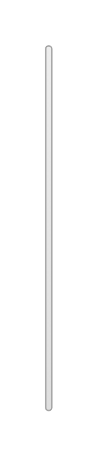

# Help text 2

## Definition

```js
{
  _style: {
    entity: 'html=1;shadow=0;dashed=0;shape=mxgraph.bootstrap.checkbox2;labelPosition=right;verticalLabelPosition=middle;align=left;verticalAlign=middle;gradientColor=#DEDEDE;fillColor=#EDEDED;strokeColor=#A6A6A6;checked=0;spacing=5;fontColor=#6C767D;checkedFill=#0085FC;checkedStroke=#ffffff;',
  },
  _width: 4,
  _height: 240,
}
```

## Usage

```js
import { HelpText2 } from '@dinghy/standard-components-diagrams/bootstrap'

<HelpText2/>
```

## Preview


