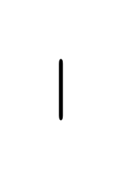

# Stacked checkboxes 2

## Definition

```js
{
  _style: {
    entity: 'html=1;shadow=0;dashed=0;shape=mxgraph.bootstrap.checkbox2;labelPosition=right;verticalLabelPosition=middle;align=left;verticalAlign=middle;gradientColor=#DEDEDE;fillColor=#EDEDED;checked=0;spacing=5;fontColor=#6C767D;checkedFill=#0085FC;checkedStroke=#ffffff;sketch=0;',
  },
  _width: 1,
  _height: 30,
}
```

## Usage

```js
import { StackedCheckboxes2 } from '@dinghy/standard-components-diagrams/bootstrap'

<StackedCheckboxes2/>
```

## Preview


