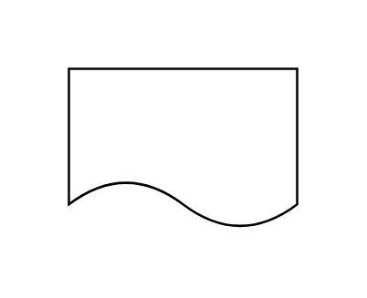

# Information / Data Carrier / SOP

## Definition

```js
{
  _style: {
    entity: 'shape=document;whiteSpace=wrap;html=1;boundedLbl=1;dashed=0;flipH=1;',
  },
  _width: 100,
  _height: 70,
}
```

## Usage

```js
import { InformationDataCarrierSop } from '@dinghy/standard-components-diagrams/dataFlowDiagram'

<InformationDataCarrierSop/>
```

## Preview


