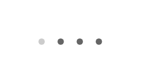

# Page control

## Definition

```js
{
  _style: {
    entity: 'verticalLabelPosition=bottom;verticalAlign=top;html=1;shadow=0;dashed=0;strokeWidth=1;shape=mxgraph.ios.iPageControl;fillColor=#666666;strokeColor=#cccccc;sketch=0;',
  },
  _width: 50,
  _height: 5,
}
```

## Usage

```js
import { PageControl } from '@dinghy/standard-components-diagrams/ios6'

<PageControl/>
```

## Preview


