# iOS iOS7 UI Entities

- [ActionDialog](./action-dialog.md)  

- [ActionSheet](./action-sheet.md)  

- [ActionSheet2](./action-sheet-2.md)  

- [Add](./add.md)  

- [Adjust](./adjust.md)  
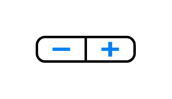

- [Alert](./alert.md)  

- [AppBarLandscape](./app-bar-landscape.md)  
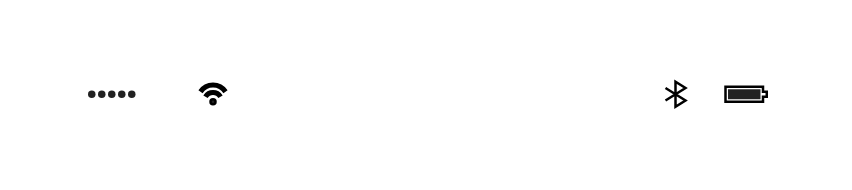

- [AppBarPortrait](./app-bar-portrait.md)  
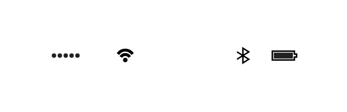

- [Bluetooth](./bluetooth.md)  
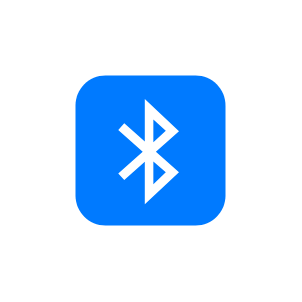

- [Broadcast](./broadcast.md)  
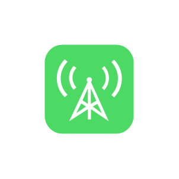

- [CallPad](./call-pad.md)  
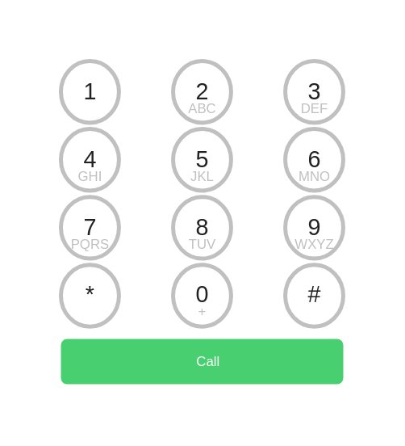

- [CellList](./cell-list.md)  

- [Check](./check.md)  

- [Circle](./circle.md)  
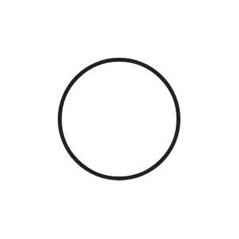

- [ContactsBar](./contacts-bar.md)  
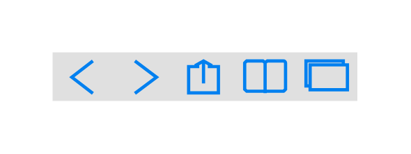

- [CurrentLocation](./current-location.md)  
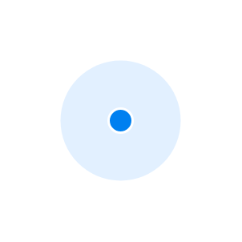

- [Delete](./delete.md)  
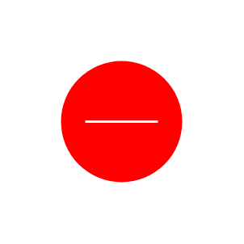

- [Dialog](./dialog.md)  
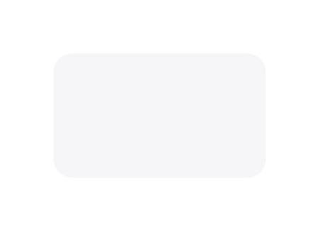

- [Down](./down.md)  

- [DownloadBar](./download-bar.md)  
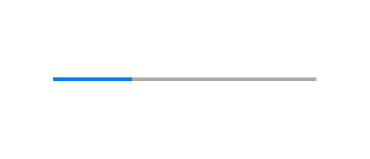

- [EditBar](./edit-bar.md)  
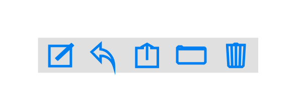

- [Expand](./expand.md)  

- [Flagged](./flagged.md)  

- [HorizontalButtonBar](./horizontal-button-bar.md)  

- [Icon](./icon.md)  
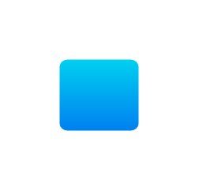

- [IconGrid](./icon-grid.md)  
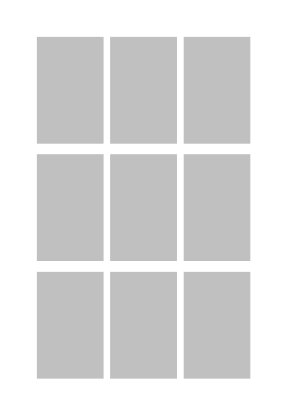

- [Increase](./increase.md)  
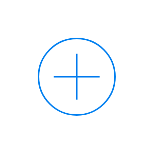

- [Info](./info.md)  
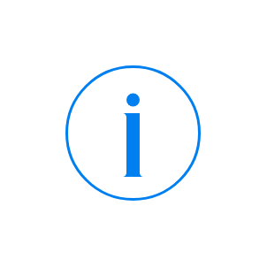

- [Ipad10](./ipad-10.md)  

- [Ipad13](./ipad-13.md)  
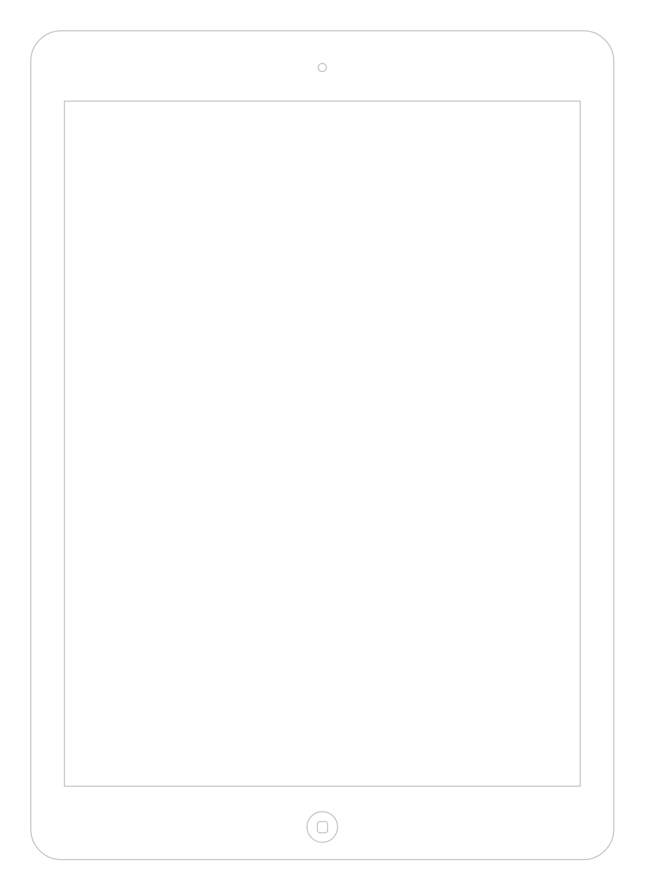

- [Ipad7](./ipad-7.md)  
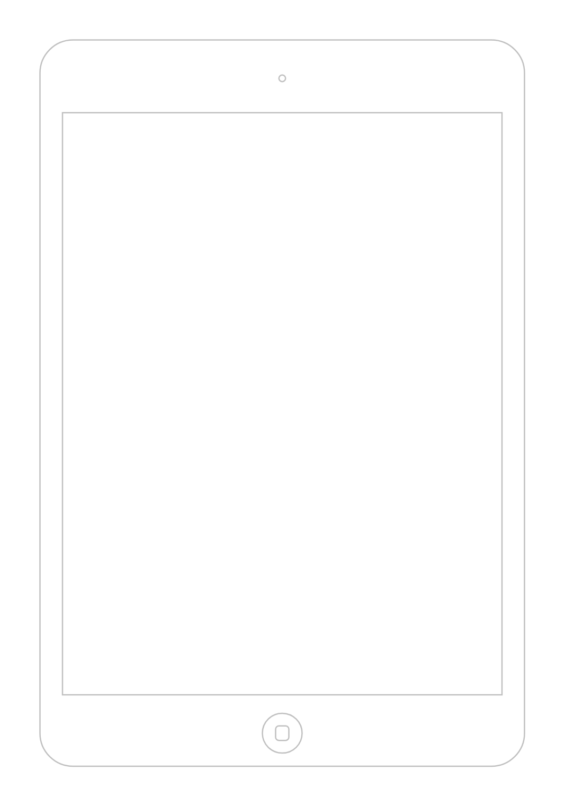

- [IphonePortrait](./iphone-portrait.md)  

- [IphoneKeyboardLetters](./iphone-keyboard-letters.md)  
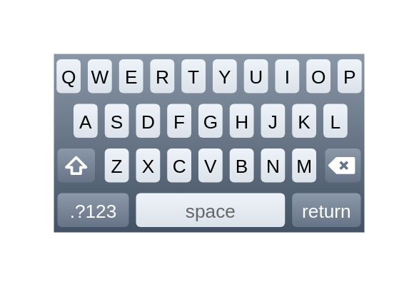

- [IphoneKeyboardNumbers](./iphone-keyboard-numbers.md)  

- [IphoneKeyboardSymbols](./iphone-keyboard-symbols.md)  
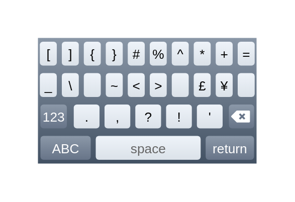

- [Keyboard](./keyboard.md)  
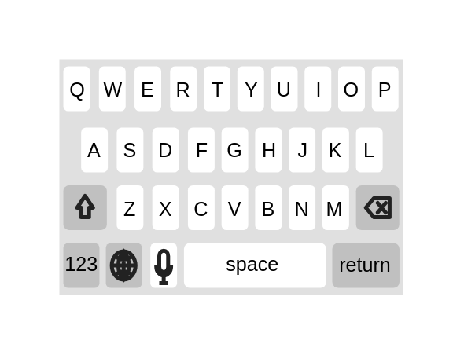

- [Labels](./labels.md)  

- [Left](./left.md)  

- [Link](./link.md)  
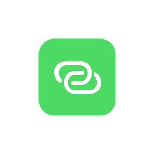

- [LoadingCircle](./loading-circle.md)  

- [Message](./message.md)  
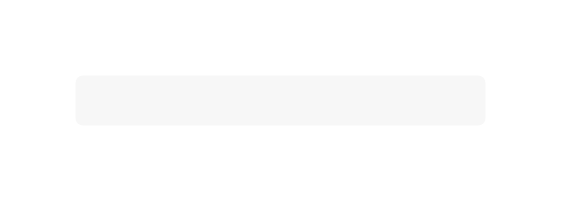

- [Message2](./message-2.md)  

- [Message3](./message-3.md)  

- [MessageBar](./message-bar.md)  
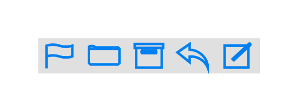

- [MiscBar](./misc-bar.md)  
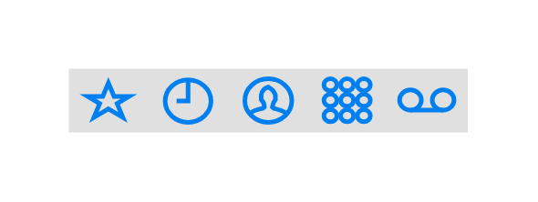

- [More](./more.md)  

- [More2](./more-2.md)  

- [Night](./night.md)  

- [Notification](./notification.md)  

- [NumberPad](./number-pad.md)  
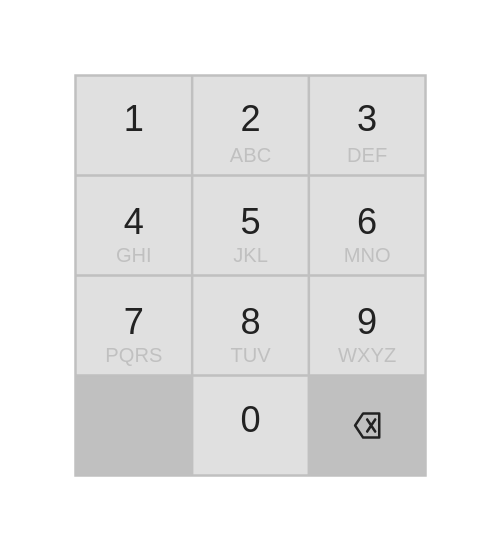

- [OnOffButtonOff](./on-off-button-off.md)  
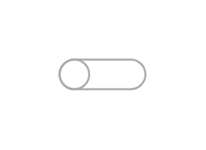

- [OnOffButtonOn](./on-off-button-on.md)  

- [Options](./options.md)  
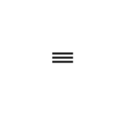

- [PageControl](./page-control.md)  
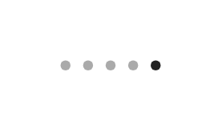

- [Pause](./pause.md)  

- [Picker](./picker.md)  

- [Remove](./remove.md)  

- [Right](./right.md)  

- [ScrollHorizontal](./scroll-horizontal.md)  
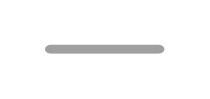

- [ScrollVertical](./scroll-vertical.md)  

- [SearchBox](./search-box.md)  

- [SearchBox2](./search-box-2.md)  

- [Select](./select.md)  

- [SelectBar](./select-bar.md)  
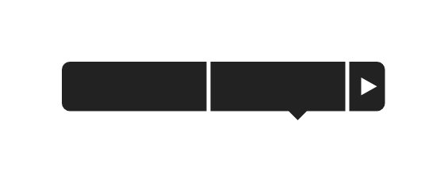

- [SelectBar2](./select-bar-2.md)  

- [Settings](./settings.md)  

- [Slider](./slider.md)  
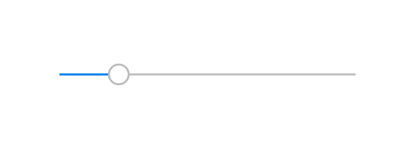

- [Star](./star.md)  

- [Switch](./switch.md)  

- [TextSize](./text-size.md)  

- [Travel](./travel.md)  

- [Up](./up.md)  

- [Url](./url.md)  

- [VolumeControl](./volume-control.md)  

- [Vpn](./vpn.md)  

- [Wifi](./wifi.md)  
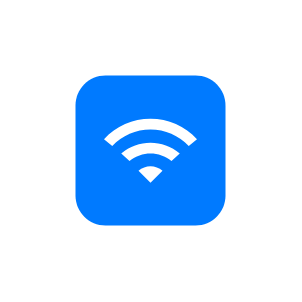
