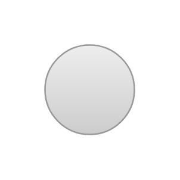

# Radiobutton

## Definition

```js
{
  _style: {
    entity: 'shape=ellipse;fillColor=#eeeeee;strokeColor=#999999;gradientColor=#cccccc;html=1;align=left;spacingLeft=4;fontSize=17;fontColor=#666666;labelPosition=right;shadow=0;',
  },
  _original_width: 15,
  _original_height: 15,

}
```

## Usage

```js
import { Radiobutton } from '@dinghy/standard-components-diagrams/mockupForms'

<Radiobutton/>
```

## Preview


