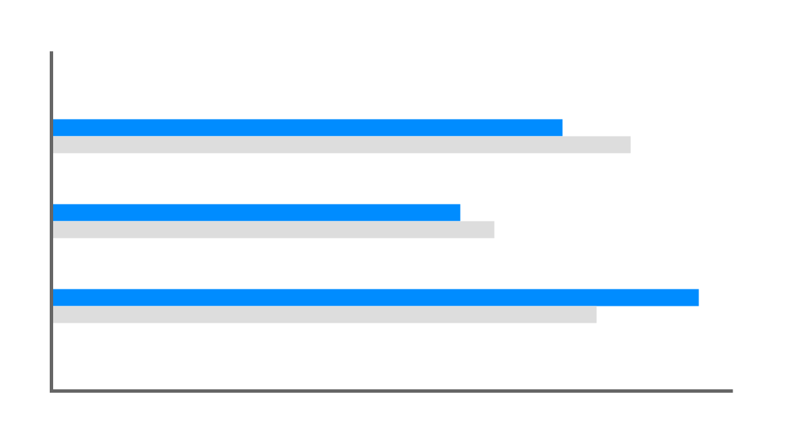
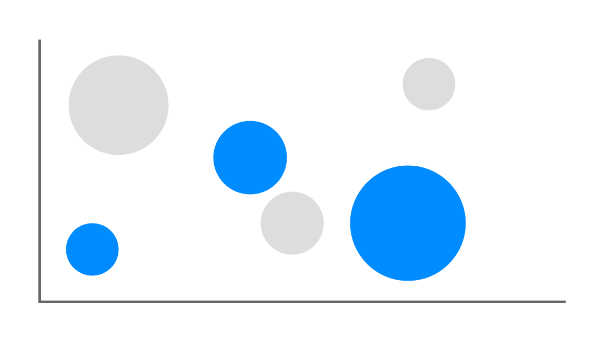
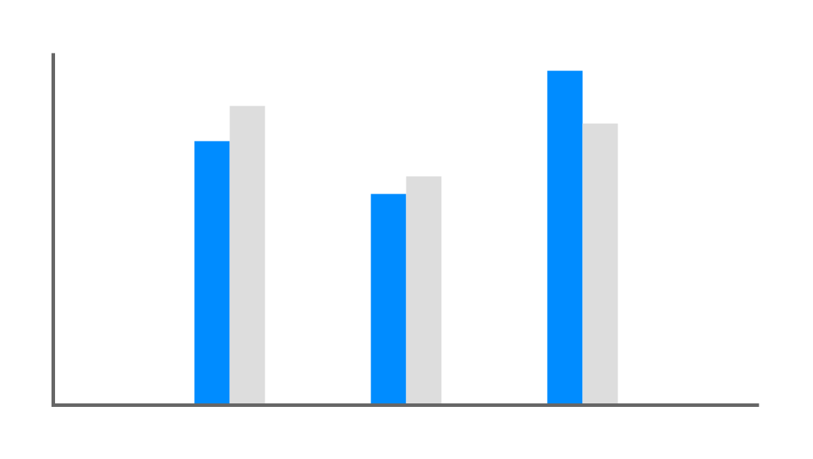
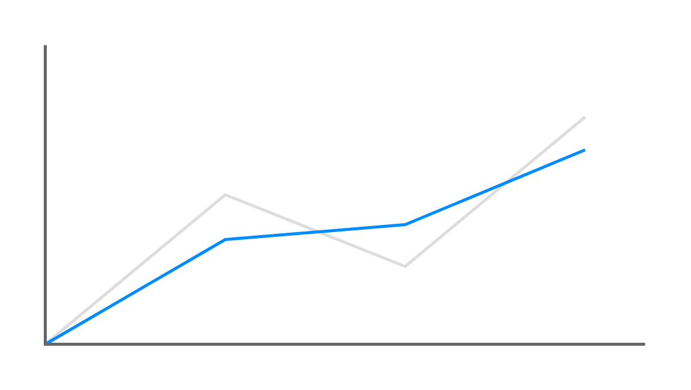
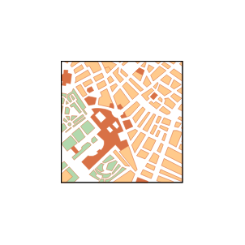
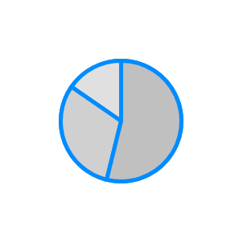
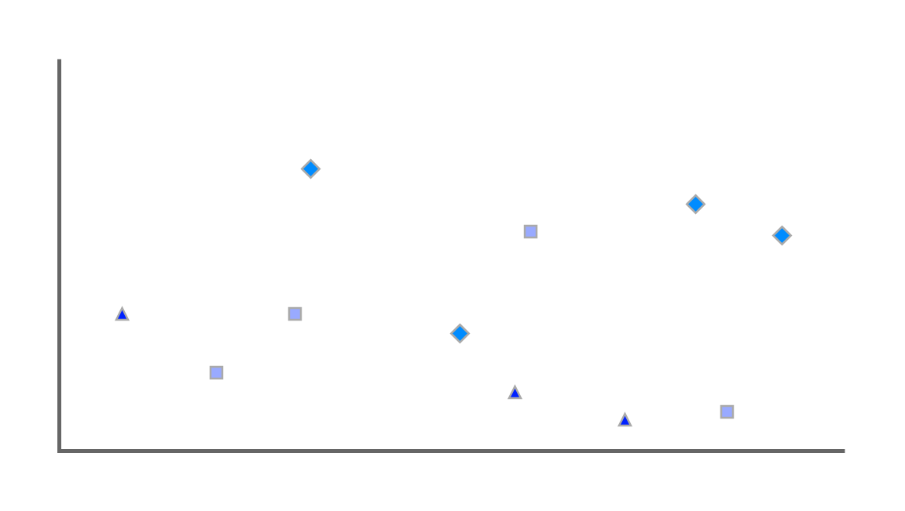

# Mockup Graphics Entities

- [BarChart](./bar-chart.md)  

- [BubbleChart](./bubble-chart.md)  

- [ColumnChart](./column-chart.md)  

- [GanttChart](./gantt-chart.md)  

- [Gauge](./gauge.md)  

- [IconGrid](./icon-grid.md)  

- [IconPlaceholder](./icon-placeholder.md)  

- [LineChart](./line-chart.md)  

- [Map](./map.md)  

- [PieChart](./pie-chart.md)  

- [PlotChart](./plot-chart.md)  

