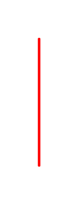

# Condition 2

## Definition

```js
{
  _style: {
    entity: 'edgeStyle=orthogonalEdgeStyle;html=1;align=left;verticalAlign=bottom;endArrow=open;endSize=8;strokeColor=#ff0000;',
  },
  _width: 1,
  _height: 100,
}
```

## Usage

```js
import { Condition2 } from '@dinghy/standard-components-diagrams/uml'

<Condition2/>
```

## Preview


