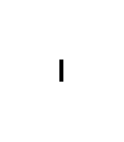

# Lollipop Notation 2

## Definition

```js
{
  _style: {
    entity: 'rounded=0;orthogonalLoop=1;jettySize=auto;html=1;endArrow=oval;endFill=0;sketch=0;sourcePerimeterSpacing=0;targetPerimeterSpacing=0;endSize=10;',
  },
  _width: 1,
  _height: 10,
}
```

## Usage

```js
import { LollipopNotation2 } from '@dinghy/standard-components-diagrams/uml'

<LollipopNotation2/>
```

## Preview


