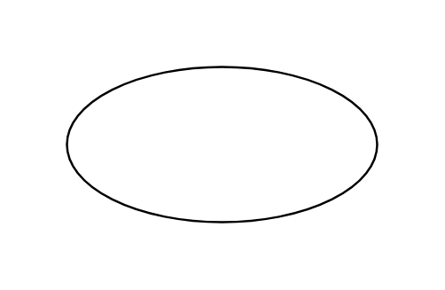

# Use Case

## Definition

```js
{
  _style: {
    entity: 'ellipse;whiteSpace=wrap;html=1;',
  },
  _width: 140,
  _height: 70,
}
```

## Usage

```js
import { UseCase } from '@dinghy/standard-components-diagrams/uml'

<UseCase/>
```

## Preview


