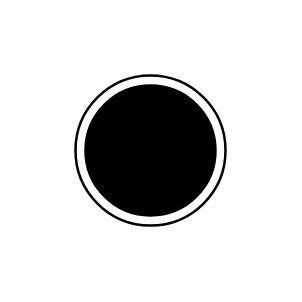

# Final state / node

## Definition

```js
{
  _style: {
    entity: 'ellipse;html=1;shape=endState;fillColor=strokeColor;',
  },
  _original_width: 30,
  _original_height: 30,

}
```

## Usage

```js
import { FinalStateNode } from '@dinghy/standard-components-diagrams/uml25'

<FinalStateNode/>
```

## Preview


