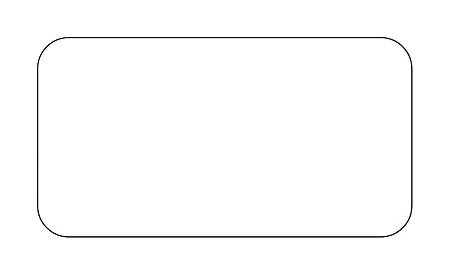

# Single Execution

## Definition

```js
{
  _style: {
    entity: 'html=1;align=right;verticalAlign=top;rounded=1;absoluteArcSize=1;arcSize=50;dashed=0;spacingTop=10;spacingRight=30;whiteSpace=wrap;',
  },
  _width: 300,
  _height: 160,
}
```

## Usage

```js
import { SingleExecution } from '@dinghy/standard-components-diagrams/uml25'

<SingleExecution/>
```

## Preview


