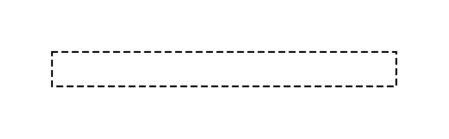

# Template signature

## Definition

```js
{
  _style: {
    entity: 'shape=partialRectangle;html=1;top=1;align=left;dashed=1;',
  },
  _width: 200,
  _height: 20,
}
```

## Usage

```js
import { TemplateSignature } from '@dinghy/standard-components-diagrams/uml25'

<TemplateSignature/>
```

## Preview


