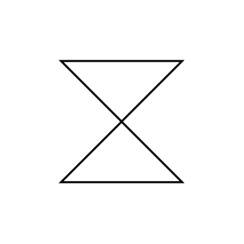

# Time Event Trigger

## Definition

```js
{
  _style: {
    entity: 'shape=collate;html=1;',
  },
  _original_width: 40,
  _original_height: 40,

}
```

## Usage

```js
import { TimeEventTrigger } from '@dinghy/standard-components-diagrams/uml25'

<TimeEventTrigger/>
```

## Preview


