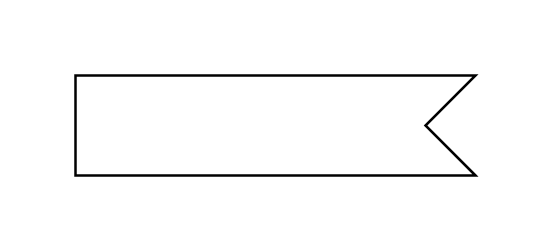

# Trigger

## Definition

```js
{
  _style: {
    entity: 'html=1;shape=mxgraph.infographic.ribbonSimple;notch1=20;notch2=0;align=center;verticalAlign=middle;fontSize=14;fontStyle=0;flipH=1;fillColor=#FFFFFF;whiteSpace=wrap;',
  },
  _width: 160,
  _height: 40,
}
```

## Usage

```js
import { Trigger } from '@dinghy/standard-components-diagrams/uml25'

<Trigger/>
```

## Preview


