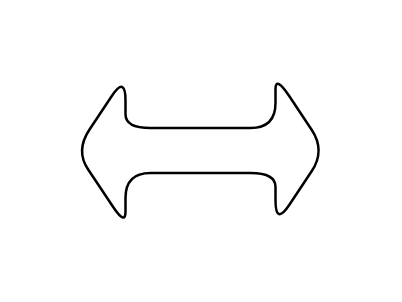

# Double Arrow

## Definition

```js
{
  _style: {
    entity: 'shape=doubleArrow;whiteSpace=wrap;html=1;',
  },
  _width: 100,
  _height: 60,
}
```

## Usage

```js
import { DoubleArrow } from '@dinghy/standard-components-diagrams/advanced'

<DoubleArrow/>
```

## Preview


