# Arrows Arrows Entities

- [ArrowDown](./arrow-down.md)  
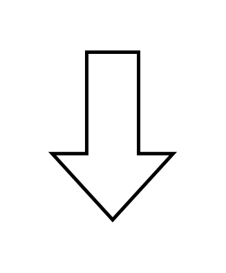

- [ArrowLeft](./arrow-left.md)  
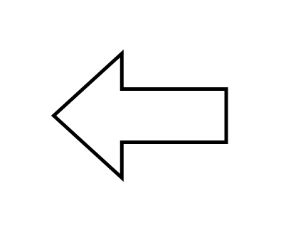

- [ArrowRight](./arrow-right.md)  
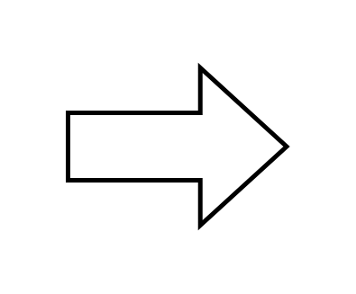

- [ArrowUp](./arrow-up.md)  
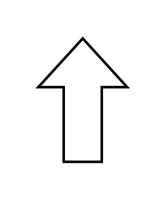

- [BentLeftArrow](./bent-left-arrow.md)  
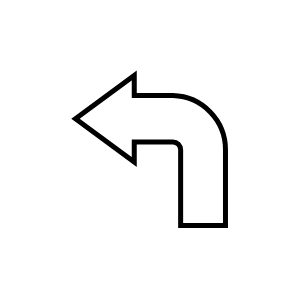

- [BentRightArrow](./bent-right-arrow.md)  

- [BentUpArrow](./bent-up-arrow.md)  
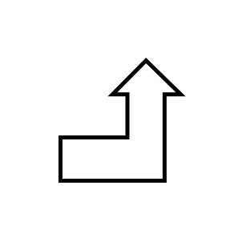

- [CalloutDoubleArrow](./callout-double-arrow.md)  
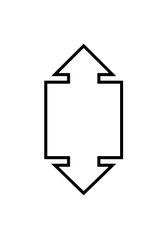

- [CalloutQuadArrow](./callout-quad-arrow.md)  
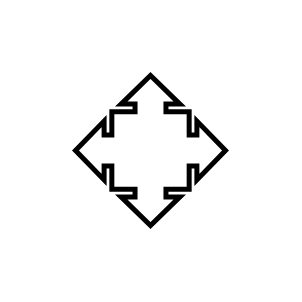

- [CalloutUpArrow](./callout-up-arrow.md)  
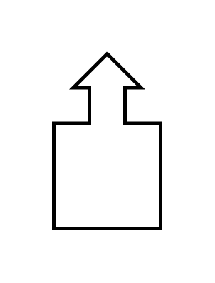

- [ChevronArrow](./chevron-arrow.md)  
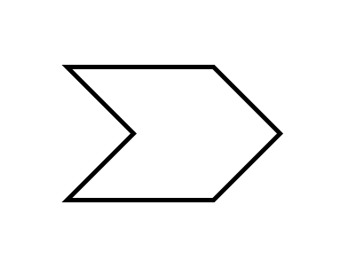

- [CircularArrow](./circular-arrow.md)  
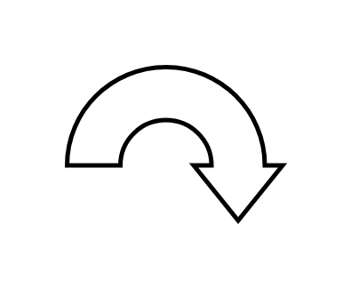

- [JumpInArrow1](./jump-in-arrow-1.md)  
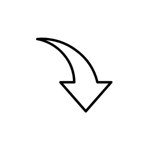

- [JumpInArrow2](./jump-in-arrow-2.md)  
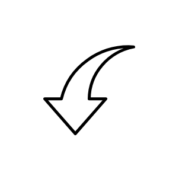

- [LeftAndUpArrow](./left-and-up-arrow.md)  
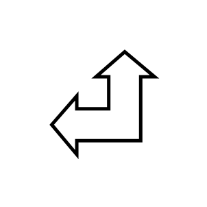

- [LeftSharpEdgedHeadArrow](./left-sharp-edged-head-arrow.md)  

- [NotchedSignalInArrow](./notched-signal-in-arrow.md)  

- [QuadArrow](./quad-arrow.md)  
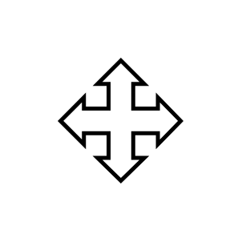

- [RightNotchedArrow](./right-notched-arrow.md)  
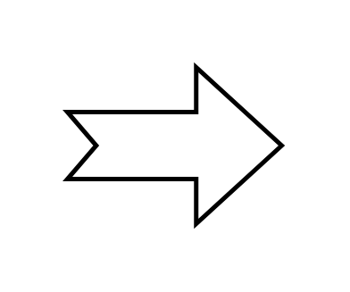

- [SharpEdgedArrow](./sharp-edged-arrow.md)  
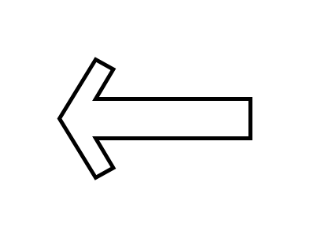

- [SignalInArrow](./signal-in-arrow.md)  
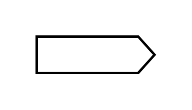

- [SlenderLeftArrow](./slender-left-arrow.md)  
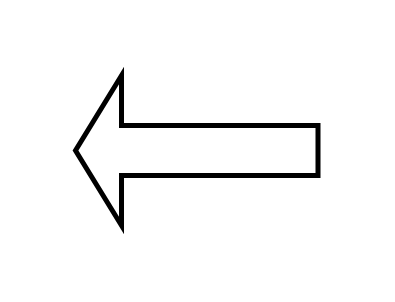

- [SlenderTwoWayArrow](./slender-two-way-arrow.md)  
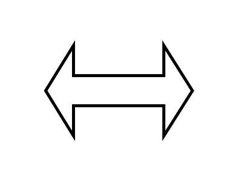

- [SlenderWideTailedArrow](./slender-wide-tailed-arrow.md)  
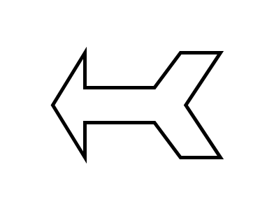

- [StripedArrow](./striped-arrow.md)  
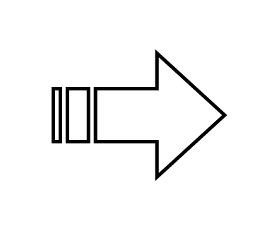

- [StylisedNotchedArrow](./stylised-notched-arrow.md)  
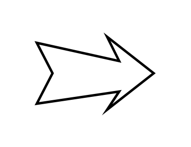

- [TriadArrow](./triad-arrow.md)  
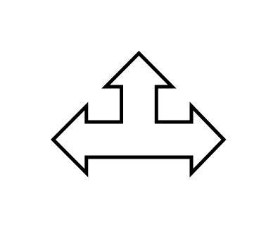

- [TwoWayArrowHorizontal](./two-way-arrow-horizontal.md)  
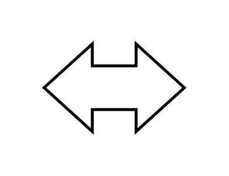

- [TwoWayArrowVertical](./two-way-arrow-vertical.md)  
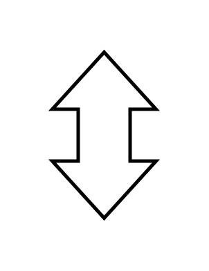

- [UTurnArrow](./u-turn-arrow.md)  
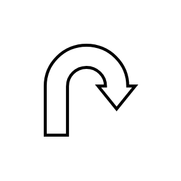

- [UTurnDownArrow](./u-turn-down-arrow.md)  
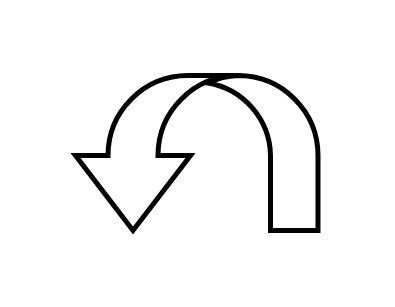

- [UTurnLeftArrow](./u-turn-left-arrow.md)  
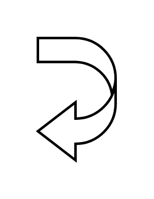

- [UTurnRightArrow](./u-turn-right-arrow.md)  
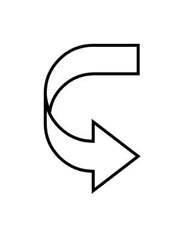

- [UTurnUpArrow](./u-turn-up-arrow.md)  
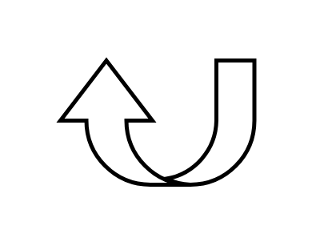
