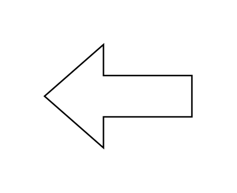

# Arrow Left

## Definition

```js
{
  _style: {
    entity: 'html=1;shadow=0;dashed=0;align=center;verticalAlign=middle;shape=mxgraph.arrows2.arrow;dy=0.6;dx=40;flipH=1;notch=0;',
  },
  _width: 100,
  _height: 70,
}
```

## Usage

```js
import { ArrowLeft } from '@dinghy/standard-components-diagrams/arrows2'

<ArrowLeft/>
```

## Preview


