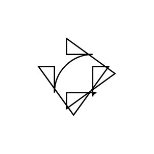

# Bend Double Arrow 2

## Definition

```js
{
  _style: {
    entity: 'html=1;shadow=0;dashed=0;align=center;verticalAlign=middle;shape=mxgraph.arrows2.bendDoubleArrow;dy=15;dx=38;arrowHead=55;rounded=1;',
  },
  _original_width: 100,
  _original_height: 100,

}
```

## Usage

```js
import { BendDoubleArrow2 } from '@dinghy/standard-components-diagrams/arrows2'

<BendDoubleArrow2/>
```

## Preview


