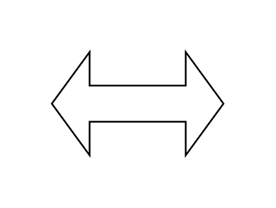

# Slender Two Way Arrow

## Definition

```js
{
  _style: {
    entity: 'html=1;shadow=0;dashed=0;align=center;verticalAlign=middle;shape=mxgraph.arrows2.twoWayArrow;dy=0.65;dx=22;',
  },
  _width: 100,
  _height: 60,
}
```

## Usage

```js
import { SlenderTwoWayArrow } from '@dinghy/standard-components-diagrams/arrows2'

<SlenderTwoWayArrow/>
```

## Preview


