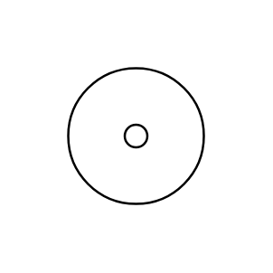

# Donut

## Definition

```js
{
  _style: {
    entity: 'verticalLabelPosition=bottom;verticalAlign=top;html=1;shape=mxgraph.basic.donut;dx=25;',
  },
  _original_width: 100,
  _original_height: 100,

}
```

## Usage

```js
import { Donut } from '@dinghy/standard-components-diagrams/basic'

<Donut/>
```

## Preview


