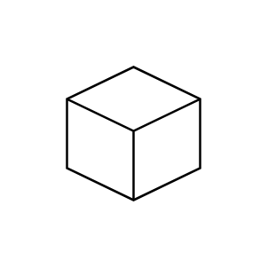

# Isometric Cube

## Definition

```js
{
  _style: {
    entity: 'html=1;shape=mxgraph.basic.isocube;isoAngle=15;',
  },
  _original_width: 100,
  _original_height: 100,

}
```

## Usage

```js
import { IsometricCube } from '@dinghy/standard-components-diagrams/basic'

<IsometricCube/>
```

## Preview


