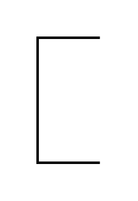

# Annotation

## Definition

```js
{
  _style: {
    entity: 'strokeWidth=2;html=1;shape=mxgraph.flowchart.annotation_1;align=left;pointerEvents=1;',
  },
  _width: 50,
  _height: 100,
}
```

## Usage

```js
import { Annotation } from '@dinghy/standard-components-diagrams/flowchart'

<Annotation/>
```

## Preview


