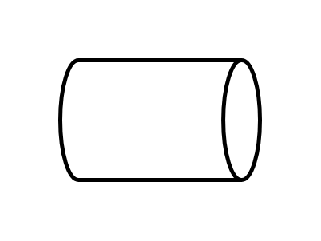

# Direct Data

## Definition

```js
{
  _style: {
    entity: 'strokeWidth=2;html=1;shape=mxgraph.flowchart.direct_data;whiteSpace=wrap;',
  },
  _width: 100,
  _height: 60,
}
```

## Usage

```js
import { DirectData } from '@dinghy/standard-components-diagrams/flowchart'

<DirectData/>
```

## Preview


