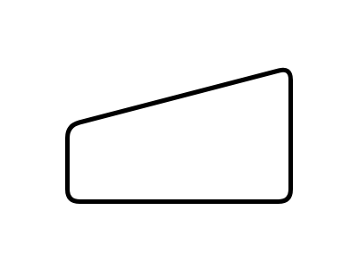

# Manual Input

## Definition

```js
{
  _style: {
    entity: 'html=1;strokeWidth=2;shape=manualInput;whiteSpace=wrap;rounded=1;size=26;arcSize=11;',
  },
  _width: 100,
  _height: 60,
}
```

## Usage

```js
import { ManualInput } from '@dinghy/standard-components-diagrams/flowchart'

<ManualInput/>
```

## Preview


