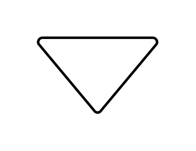

# Merge or Storage

## Definition

```js
{
  _style: {
    entity: 'strokeWidth=2;html=1;shape=mxgraph.flowchart.merge_or_storage;whiteSpace=wrap;',
  },
  _width: 95,
  _height: 60,
}
```

## Usage

```js
import { MergeOrStorage } from '@dinghy/standard-components-diagrams/flowchart'

<MergeOrStorage/>
```

## Preview


