# Standard General Entities

- [Actor](./actor.md)  

- [And](./and.md)  
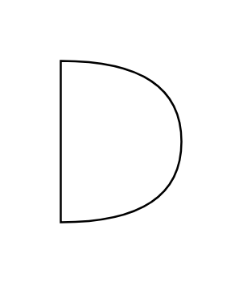

- [Callout](./callout.md)  

- [Card](./card.md)  
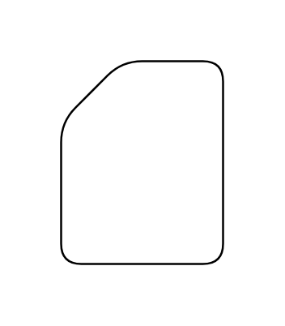

- [Circle](./circle.md)  

- [Cloud](./cloud.md)  
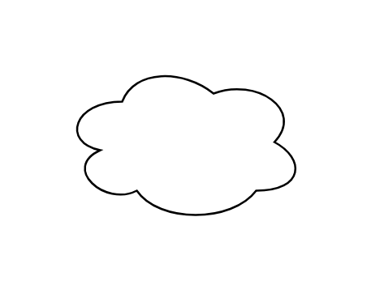

- [Container](./container.md)  
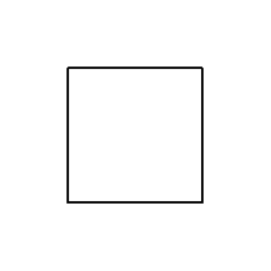

- [Container2](./container-2.md)  
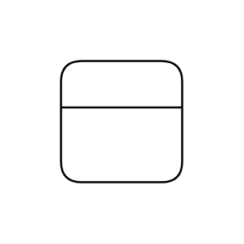

- [Cube](./cube.md)  
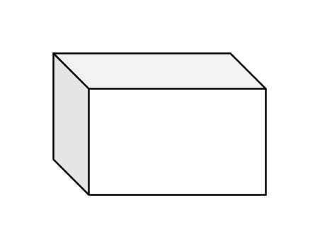

- [Cylinder](./cylinder.md)  
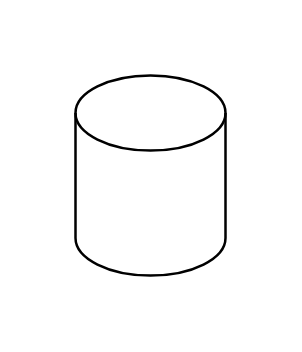

- [DataStorage](./data-storage.md)  
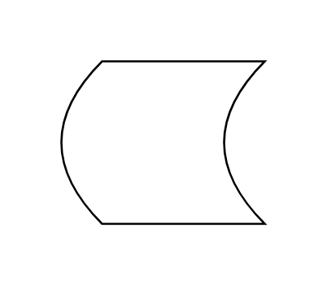

- [Diamond](./diamond.md)  

- [Document](./document.md)  
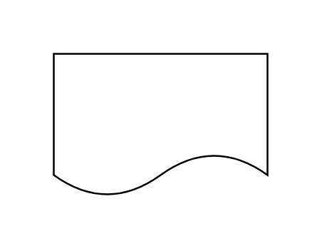

- [Ellipse](./ellipse.md)  

- [Hexagon](./hexagon.md)  
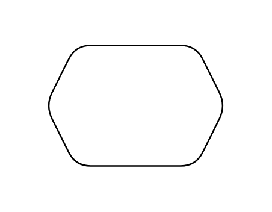

- [HorizontalContainer](./horizontal-container.md)  
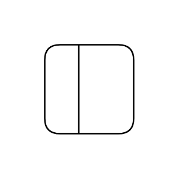

- [InternalStorage](./internal-storage.md)  

- [List](./list.md)  

- [ListItem](./list-item.md)  

- [Note](./note.md)  
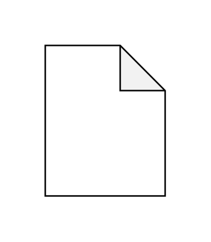

- [Or](./or.md)  
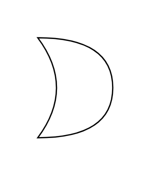

- [Parallelogram](./parallelogram.md)  
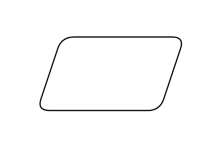

- [Process](./process.md)  
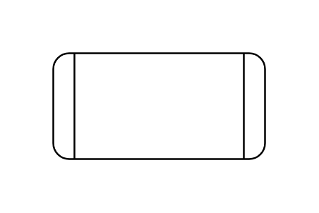

- [Rectangle](./rectangle.md)  

- [RoundedRectangle](./rounded-rectangle.md)  
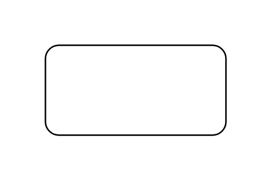

- [Square](./square.md)  

- [Step](./step.md)  

- [Tape](./tape.md)  
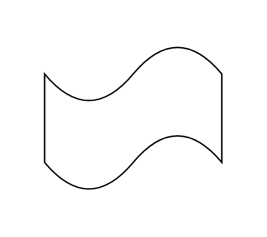

- [Text](./text.md)  

- [Textbox](./textbox.md)  

- [Trapezoid](./trapezoid.md)  

- [Triangle](./triangle.md)  
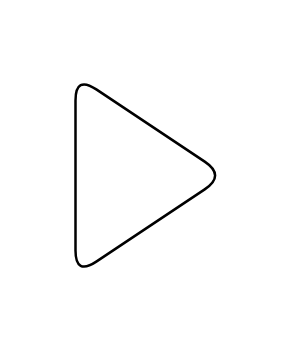
