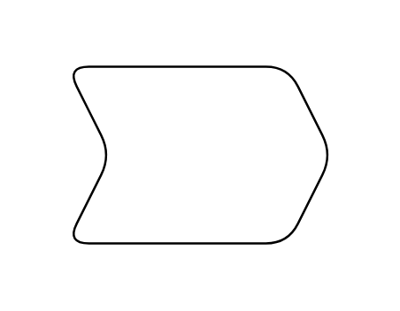

# Step

## Definition

```js
{
  _style: {
    entity: 'shape=step;perimeter=stepPerimeter;whiteSpace=wrap;html=1;fixedSize=1;',
  },
  _width: 120,
  _height: 80,
}
```

## Usage

```js
import { Step } from '@dinghy/standard-components-diagrams/general'

<Step/>
```

## Preview


