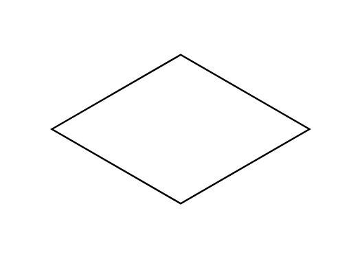

# Isometric Square

## Definition

```js
{
  _style: {
    entity: 'html=1;whiteSpace=wrap;aspect=fixed;shape=isoRectangle;',
  },
  _width: 150,
  _height: 90,
}
```

## Usage

```js
import { IsometricSquare } from '@dinghy/standard-components-diagrams/misc'

<IsometricSquare/>
```

## Preview


