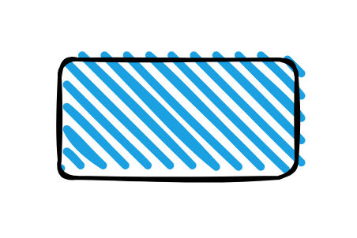

# Rectangle Sketch

## Definition

```js
{
  _style: {
    entity: 'rounded=1;whiteSpace=wrap;html=1;strokeWidth=2;fillWeight=4;hachureGap=8;hachureAngle=45;fillColor=#1ba1e2;sketch=1;',
  },
  _width: 120,
  _height: 60,
}
```

## Usage

```js
import { RectangleSketch } from '@dinghy/standard-components-diagrams/misc'

<RectangleSketch/>
```

## Preview


