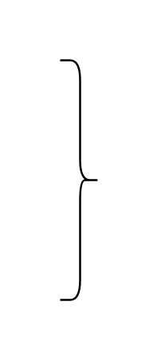

# Right Curly Bracket

## Definition

```js
{
  _style: {
    entity: 'shape=curlyBracket;whiteSpace=wrap;html=1;rounded=1;flipH=1;labelPosition=right;verticalLabelPosition=middle;align=left;verticalAlign=middle;',
  },
  _width: 20,
  _height: 120,
}
```

## Usage

```js
import { RightCurlyBracket } from '@dinghy/standard-components-diagrams/misc'

<RightCurlyBracket/>
```

## Preview


