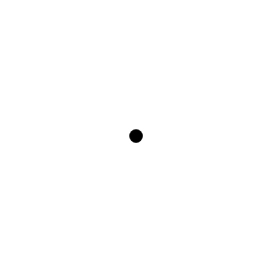

# Waypoint

## Definition

```js
{
  _style: {
    entity: 'shape=waypoint;sketch=0;fillStyle=solid;size=6;pointerEvents=1;points=[];fillColor=none;resizable=0;rotatable=0;perimeter=centerPerimeter;snapToPoint=1;',
  },
  _original_width: 20,
  _original_height: 20,

}
```

## Usage

```js
import { Waypoint } from '@dinghy/standard-components-diagrams/misc'

<Waypoint/>
```

## Preview


