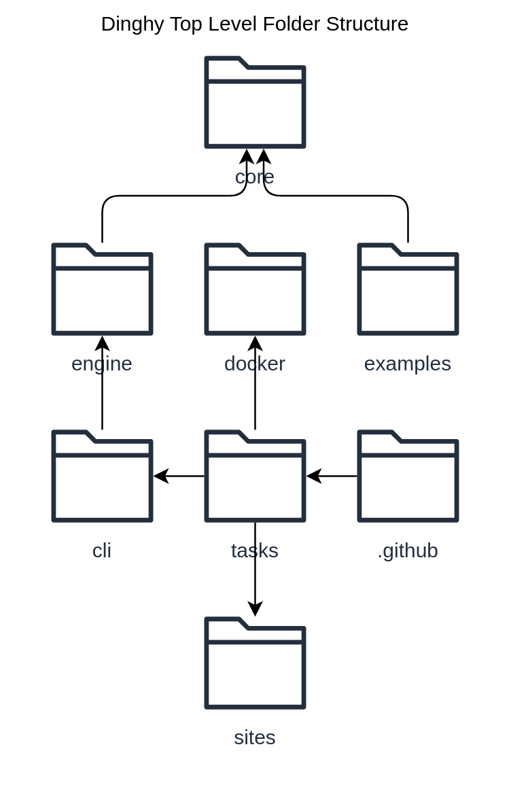
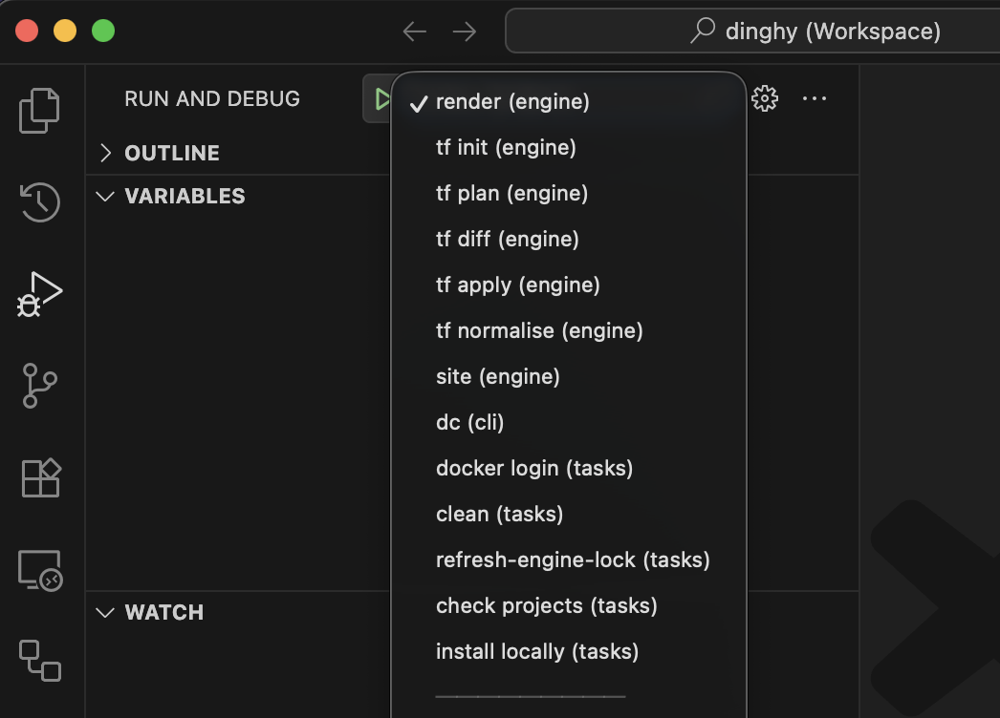

# Contributing Code

## Local Development

This project is developed with deno and VSCode. This is a monorepo, meaning the
repo holds multiple projects.

### Install deno

It requires the use of [Deno](https://deno.com/). You can install deno with:

```sh
curl -fsSL https://deno.land/install.sh | sh
```

### Open project in VSCode

```sh
git clone git@github.com:dinghydev/dinghy.git
cd dinghy
code dinghy.code-workspace
```

:::tip

Clone from your own fork if intend to contribute the code.

:::

### Project code structure



### Debugable tasks

There are set of debugable tasks defined in `.vscode/launch.json` files of
various projects. Those are handy way to test the changes locally. You may
easily run those from `Run and Debug` panel:



## Create Pull Request

To contribute on the Dinghy code base, you should have an account on Github to
be able to
[create pull requests](https://help.github.com/articles/creating-a-pull-request)
with your changes.

Please fork https://github.com/dinghydev/dinghy and create a local clone of your
fork as explained in
[fork a repo](https://help.github.com/articles/fork-a-repo/).

Once you are satisfied with your changes:

1. commit your changes in your local branch
1. push your changes to your remote branch on Github
1. send us a
   [pull request](https://help.github.com/articles/creating-a-pull-request)
