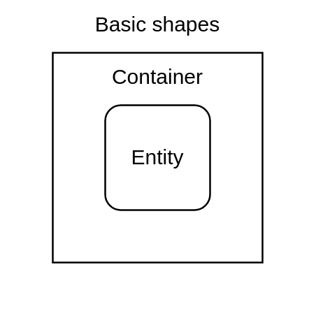
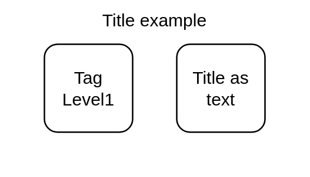
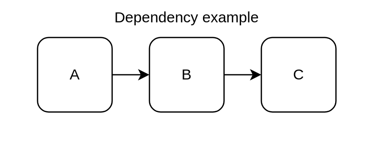

import CodeBlock from "@theme/CodeBlock";
import ShapeTsx from "!!raw-loader!./shape.tsx";
import DependencyTsx from "!!raw-loader!./dependency.tsx";
import TagsTsx from "!!raw-loader!./tags.tsx";
import TitleTsx from "!!raw-loader!./title.tsx";
import DrawioTsx from "!!raw-loader!./drawio.tsx";
import RuntimeTsx from "!!raw-loader!../architecture/runtime.tsx";

# Diagram as Code

Diagram as Code (DaC) brings the same principles of Infrastructure as Code (IaC)
to visual documentation. Instead of manually drawing diagrams in tools like
Lucidchart, draw.io or Visio, you describe them in text like Mermaid. That
description generates consistent, up-to-date diagrams.

## Why dinghy diagram

Compare to existing text based diagram such as Mermaid, dinghy provide a
programmable diagrams which turn your data and system live information into
generative, data-driven, reusable diagrams. They become living views of systems
that evolve with the code and infrastructure.

## Powered by React

Dinghy uses React as its templating engine. React is a widely adopted framework
for transforming data models into various views, from web and native apps to
hardware interfaces. While many diagramming project rely on React as a development
framework, Dinghy takes a different approach — it’s built as an end-user
tool, designed to work out of the box with zero configuration.

## Shape component

All visual object are based on Shape. A shape could be either entity or
container. When there is no visable children, a shape becomes an entity,
othereise it's a container.

<CodeBlock language="tsx" title="shape.tsx">
  {ShapeTsx}
</CodeBlock>



## Diagram attributes

You might noticed all attribute so far are all start with `_` (underscore).
That's right, the attribute name convention is that all diagram or internal attributes are
prefixed with underscore. None underscore attribute are reserved for
Infrastructure as Code data model.

For full list of supported diagram attributes, references [types/diagrams.ts](https://github.com/dinghydev/dinghy/blob/main/core/base-components/src/types/diagrams.ts) before dedicated documentation developed.

### \_tags attribute

The shape React component names are collected as `_tags`. The value will be used to populate other values automatically or programmablely.

Given example below, the `TagLevel2` component has `_tags` = `[TagLevel2, TagLevel1, Shape]`.

<CodeBlock language="tsx" title="tags.tsx">
  {TagsTsx}
</CodeBlock>

### \_title attribute

`_title` will be displayed for shape. It's default to be the first `_tags` break down by camel case splitter.

Given the above `_tags` example above, the `TagLevel2` component has `_title` = `Tag Level2`.

#### Function attribute

All attribute could be a function as well. If passed as function, it will be resolved at various stages automatically. The first parameter of function is the React `node` object which you can navigate the React fiber tree.

Given example below, the `TagLevel2` component has `_title` = `Tag Level1` .

<CodeBlock language="tsx" title="title.tsx">
  {TitleTsx}
</CodeBlock>



#### Text as title

You may also put text inside component which will resolved as `_title` for the component.

Given example above, the last `Shape` component has `_title` = `Title as text` .

### \_id attribute

`_id` is an unique identifier for the component. It's primary used for [IaC#_id](./infrastructure-as-code#_id-attribute), but you may use it to identify a unique [dependency](#dependency-component) when other match type is difficult.

Given the above `_tags` example, the last `Shape` component has [generated default](https://github.com/dinghydev/dinghy/blob/main/core/base-renderer/src/processors/p20PopulateCoreAttributes.tsx#L49) `_id` = `shape_titleastext`.

### \_view attribute

You may assign `_view` atrribute `string|string[]` to a Shape to show it only when the view was selected during rendering.

### Attributes output

The json output format contains all those core attributes you may inspect.

```sh
dinghy render --format json
```

## Dependency component

Dependency is used to express the relationships between shapes.

You may use the `Depenceny` component directly for advanced styling or just use
`_dependsOn` or `_dependsBy` attribute to draw the relationship. The value could
be single string or array of strings.

The string target will be match following attributes in order:

1. `_id` attribute
1. `_title` attribute
1. Tag of target component

<CodeBlock language="tsx" title="dependency.tsx">
  {DependencyTsx}
</CodeBlock>




## draw.io elements

You can import [draw.io libary elements](https://github.com/dinghydev/dinghy/tree/main/sites/references/diagrams/elements) into your diagram to enhance its appearance.

<CodeBlock language="tsx" title="drawio.tsx">
  {DrawioTsx}
</CodeBlock>


## Composites diagrams

We intend to build out standard set of common diagram capability so ready to use by provide simple data structure.

You may found out the list of such composites in [core/diagrams/src/composites](https://github.com/dinghydev/dinghy/tree/main/core/diagrams/src/composites).

The [Runtime sequence diagram](./architecture#runtime-sequence-diagram) of the Dinghy Architecture was defined as code below:

<CodeBlock language="tsx" title="runtime.tsx">
  {RuntimeTsx}
</CodeBlock>