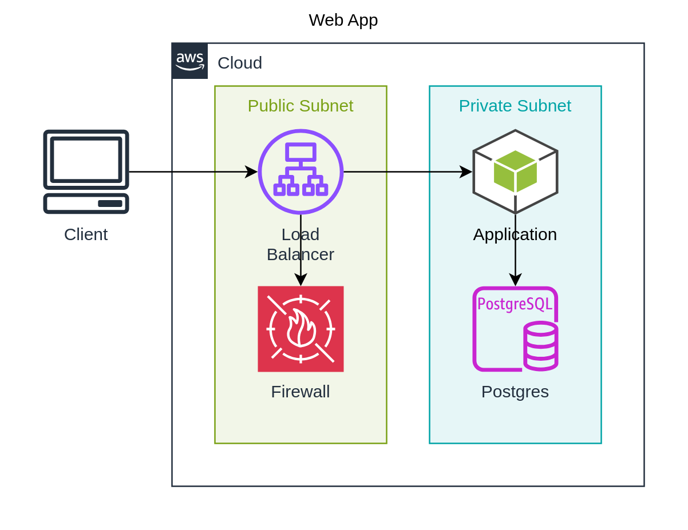

import CodeBlock from '@theme/CodeBlock'; import AppTsx from
'!!raw-loader!./app.tsx'; import AppTfJson from
'!!raw-loader!./output/app/app.tf.json';

# Step 4: Infrastructure as Code

## Overview

This example use IaC backed component from `@dinghy/tf-aws`
to not only generate same diagramm as
[Step 3: draw.io](../step-3-draw-io/README.mdx), but also
[terraform code](#terraform-code).

## Source

### app.tsx

<CodeBlock language="tsx" title="app.tsx">{AppTsx}</CodeBlock>

## Rendered

### Diagram

output/app.png

### Terraform Code

The terraform code snippet is for illustration only.

<CodeBlock language="json" title="output/app/app.tf.json">{AppTfJson}</CodeBlock>
