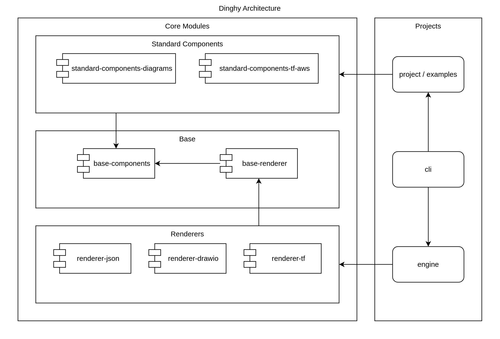
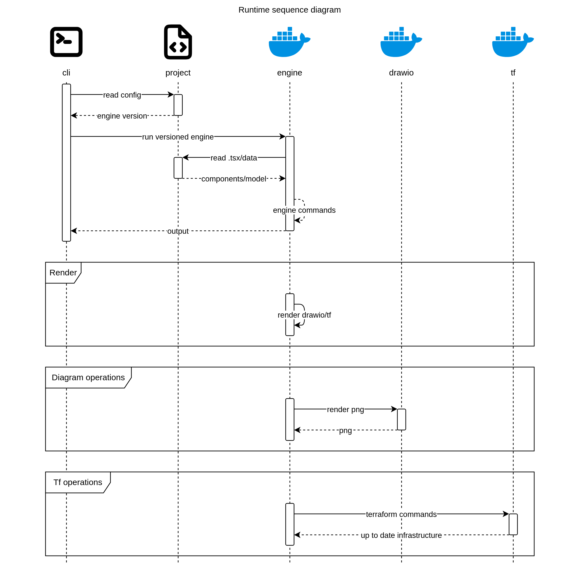

# Architecture

This page explains dinghy high‑level structure so user can quickly grasp the
core components and how they interact.

## Component diagram

### Cli

The `dinghy-cli` only contain a very small amount of logic which will be stable
to talk to wider range of more frequent changed engines.

### Engine

The engine is where everything coming togeter:

1. Engine run as a docker container
1. Your project is mapped to /dinghy/engine/workspace
1. Engine might run other docker container to perform requested actions

### Core

Core modules are where react components defined and rendering happens. You
project will depends on core components and engine will use rederders there to
render to target format.

## Runtime sequence diagram

