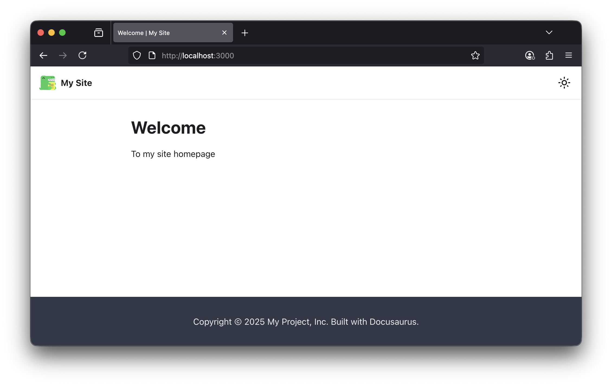

# Documentation as Code

:::info

While `Documentation as Code` is not a core function of dinghy, we use it to
build this site and want to package this neat functionality to make it easier
for developers who prefer keep everything as code with
[docusaurus.io](https://docusaurus.io/)

:::

## Simple setup

:::tip

As you can see that all you need to use docusaurus is a single file.

:::

The `site` commands is a wrap of [docusaurus.io](https://docusaurus.io/).
Instread of create a `docusaurus` project, manage setup, download dependencies
and tweak configs, you could simple just use the site command to develop your
site. e.g. create a single file as

### Homepage source

```md title="src/pages/INDEX.md"
# Welcome

To my site homepage
```

### Serve in development

```sh
dinghy site start
```

### Preview in browser

By visiting https://localhost:3000



## Site commands

Following commands are mapped to
[Docusaurus Cli](https://docusaurus.io/docs/cli)

- `start` Builds and serves a preview of your site locally
- `build` Compiles your site for production
- `serve` Serve your built website locally
- `deploy` Deploys your site to remote services

### Deploy to AWS S3

:::tip

The deployed S3 target could be served by CloudFront with simple path match.

:::

The `deploy` command has been extended to support deploy site to `AWS S3` on top
of standard
[docusaurus deploy](https://docusaurus.io/docs/cli#docusaurus-deploy-sitedir)
command.

Deploy to S3 are triggered when `deploy.s3Url` been configured. It will process
the files with optimimal settings by:

1. remove file `.html` extension when necessary to support
   [trailingSlash=false](https://docusaurus.io/docs/deployment#trailing-slashes).
1. upload root `index.html` as `/`
1. `gzip text` files before upload
1. set optimal `cache-control` headers based on mutable or not

You may found more configurable options in
[DeployConfigSchema](https://github.com/dinghydev/dinghy/blob/main/engine/src/commands/site/deploy-config-schema.ts).

### dinghy site bash

Run bash from the docusaurus container working directory. From there you can
edit files and run the site directly e.g.

```sh
yarn start --host 0.0.0.0
```

### dinghy site docusaurus

Run docusaurus command so you can pass additional args e.g.

```sh
dinghy site docusaurus -- swizzle --list
```

Which is equivalent of `docusaurus swizzle --list`

## Configuration

### docusaurus.config.yaml

It's recommended to use `docusaurus.config.yaml` to provide
[docusaurus configuration](https://docusaurus.io/docs/api/docusaurus-config).

You may provide override values with the simple yaml format where necessary.
Following top level config are intercepted and populated to correct place:

- docs
- blog
- theme
- themeConfig

Content in `src/docs` and `src/blog` will map to root without prefix which is
same behaviour as `src/pages`.

Those config are handled by
[docusaurus.config.ts](https://github.com/dinghydev/dinghy/blob/main/docker/images/40-site/fs-root/opt/docusaurus/docusaurus.config.ts),
please refer to the source code for details.

### docusaurus.config.ts

You may provide your own
[docusaurus.config.ts](https://github.com/dinghydev/dinghy/blob/main/docker/images/40-site/fs-root/opt/docusaurus/docusaurus.config.ts)
in the root folder of site to override the default for advanced control which
not possbile by configure `docusaurus.config.yaml`.

## Pre-installed packages

The npm package dependencies are installed based on project created from
[create-docusaurus](https://docusaurus.io/docs/installation#scaffold-project-website)
command.

Additional packages can be pre-installed if it's from reputable repo. Such repos
are installed bellow:

| Package                                                | Usage                                                                   |
| ------------------------------------------------------ | ----------------------------------------------------------------------- |
| [raw-loader](https://www.npmjs.com/package/raw-loader) | Importing source code files as a String for documentation shows as code |
