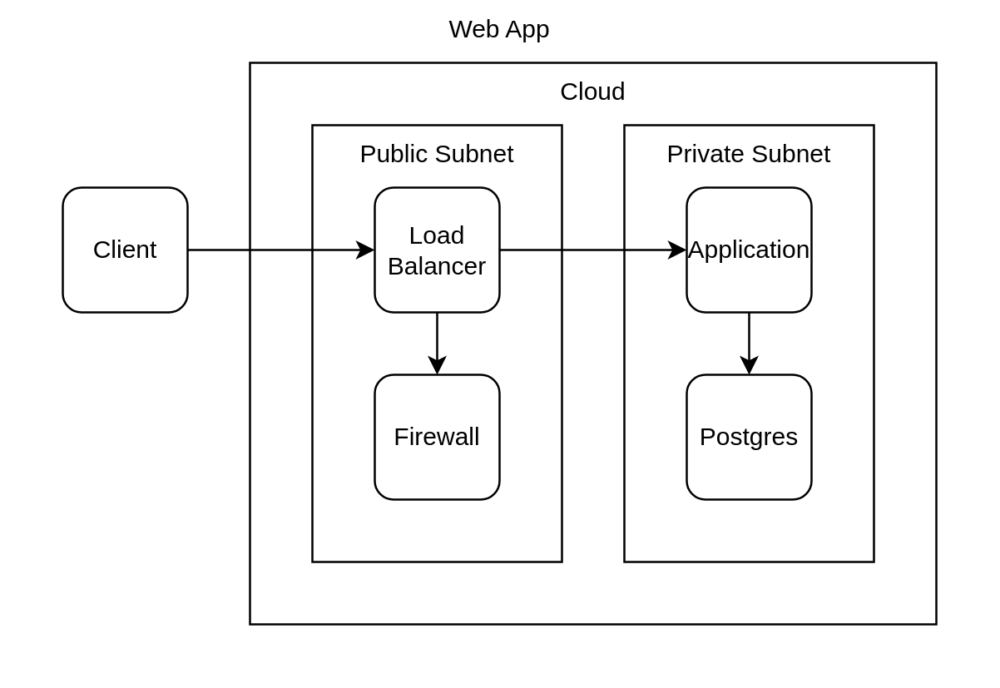

import CodeBlock from '@theme/CodeBlock'; import AppTsx from
'!!raw-loader!./app.tsx';

# Step 1: Basic Shape

## Overview

This example use only base `Shape` component syntax to define the diagram. It's
just for illustration purpose, we don't expect you to code your diagram like
this as it's not good user expereince to maintain.

## Source

### app.tsx

<CodeBlock language="tsx" title="app.tsx">{AppTsx}</CodeBlock>

## Rendered

### Diagram

output/app.png

