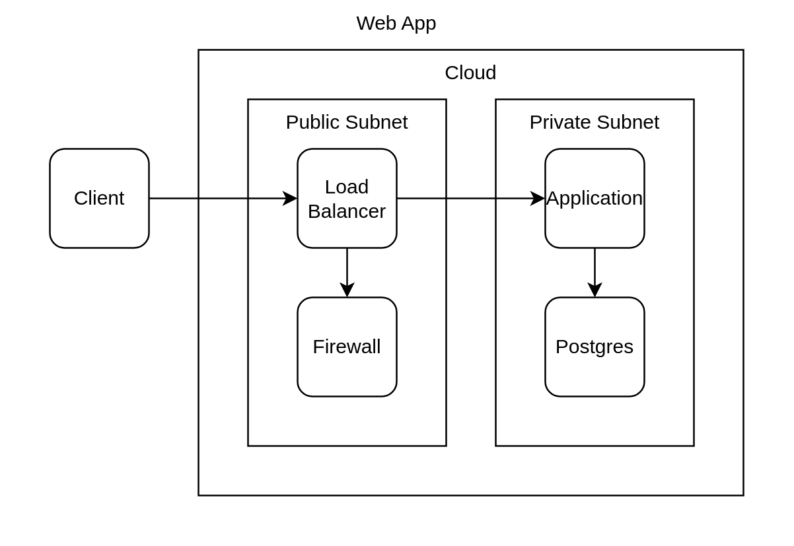

import CodeBlock from '@theme/CodeBlock'; import AppTsx from
'!!raw-loader!./app.tsx';

# Step 2: Named Component

## Overview

This example use only named component function syntax to define the diagram. It
shows a cleanner diagram defined which is shows structure clearly. It generate
the same diagram as previous
[Step 1: Basic Shape](../step-1-basic-shape/README.mdx)

## Source

### app.tsx

<CodeBlock language="tsx" title="app.tsx">{AppTsx}</CodeBlock>

## Rendered

### Diagram

output/app.png

