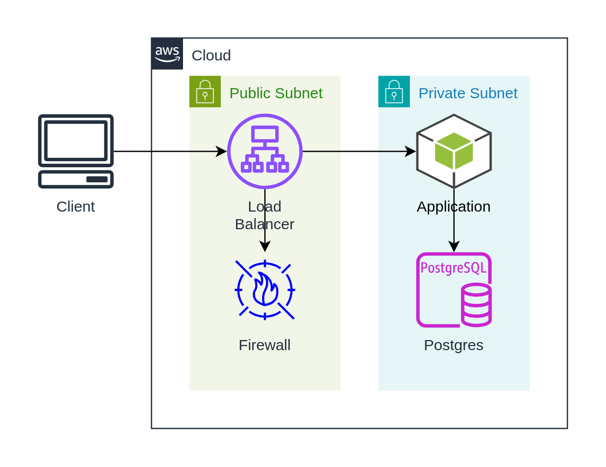

import CodeBlock from '@theme/CodeBlock'; import AppTsx from
'!!raw-loader!./app.tsx';

# Step 3: draw.io

## Overview

This example use draw.io shapes from `@dinghy/standard-components-diagrams` to
replace basic shape for the components so it looks nicer. It generate the same
structure as previous [Step 1: Basic Shape](../step-1-basic-shape/README.mdx)

## Source

### app.tsx

<CodeBlock language="tsx" title="app.tsx">{AppTsx}</CodeBlock>

## Rendered

### Diagram

output/app.png

