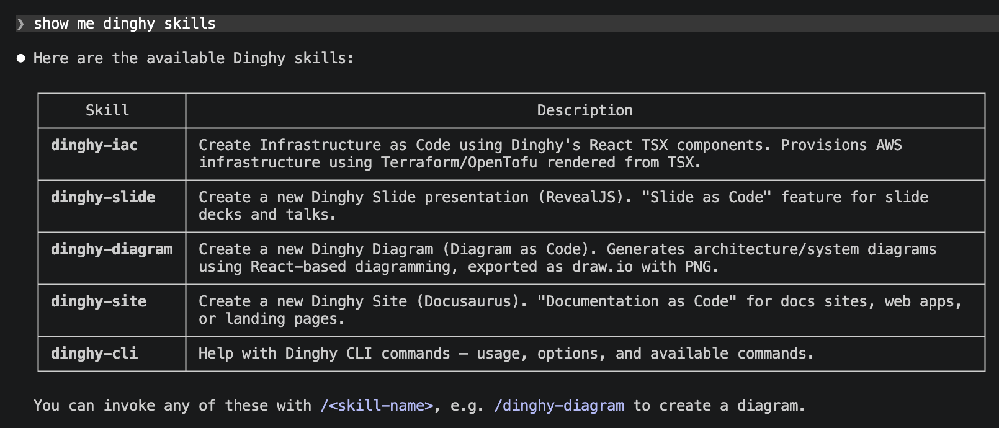

# Application Development

Most example you having see in the Get Started section is small single file. It
will be case for many use case perticular for diagrams. Feel free to use your
favourte editor editors or IDE to edit the tsx or yaml files.

## VS Code

We recommend [VS Code](https://code.visualstudio.com/) with
[Dev Containers](https://code.visualstudio.com/docs/devcontainers/containers)
extension. Once you have those installed, you may use following command to open
your project. Other VSCode based IDE ( e.g. Cursor ) may also work but didn't
tested intensively.

### [dinghy devcontainer](/references/commands/cli/devcontainer)

You may run `dinghy devcontainer` or `dinghy dc` in the project folder to open
your project in devcontainer. The devcontainer is a full-featured development
environment which has deno language server running which give you nice
autocomplete developer experience.

The devcontainer is where [Dinghy Engine](/guides/advanced/architecture#engine)
lives, so you can run engine command directly.

## Claude Code

Dinghy ships with skills for
[Claude Code](https://docs.anthropic.com/en/docs/claude-code) that teach the AI
assistant how to work with Dinghy projects.

### [dinghy skill](/references/commands/engine/skill)

Run `dinghy skill` to install or update Dinghy skills to your `.claude/skills`
directory. The command auto-detects the skills folder location from either a
project-level `.claude/skills` or user-level `~/.claude/skills`.

The following skills are included:

- **dinghy-cli** — Help with Dinghy CLI commands
- **dinghy-diagram** — Create diagrams as code using React TSX and draw.io
- **dinghy-slide** — Create RevealJS presentations as code in YAML/Markdown
- **dinghy-iac** — Infrastructure as Code with Terraform templates

Once installed, you can use slash commands like `/dinghy-slide` or
`/dinghy-diagram` in Claude Code to generate Dinghy projects with AI assistance.

