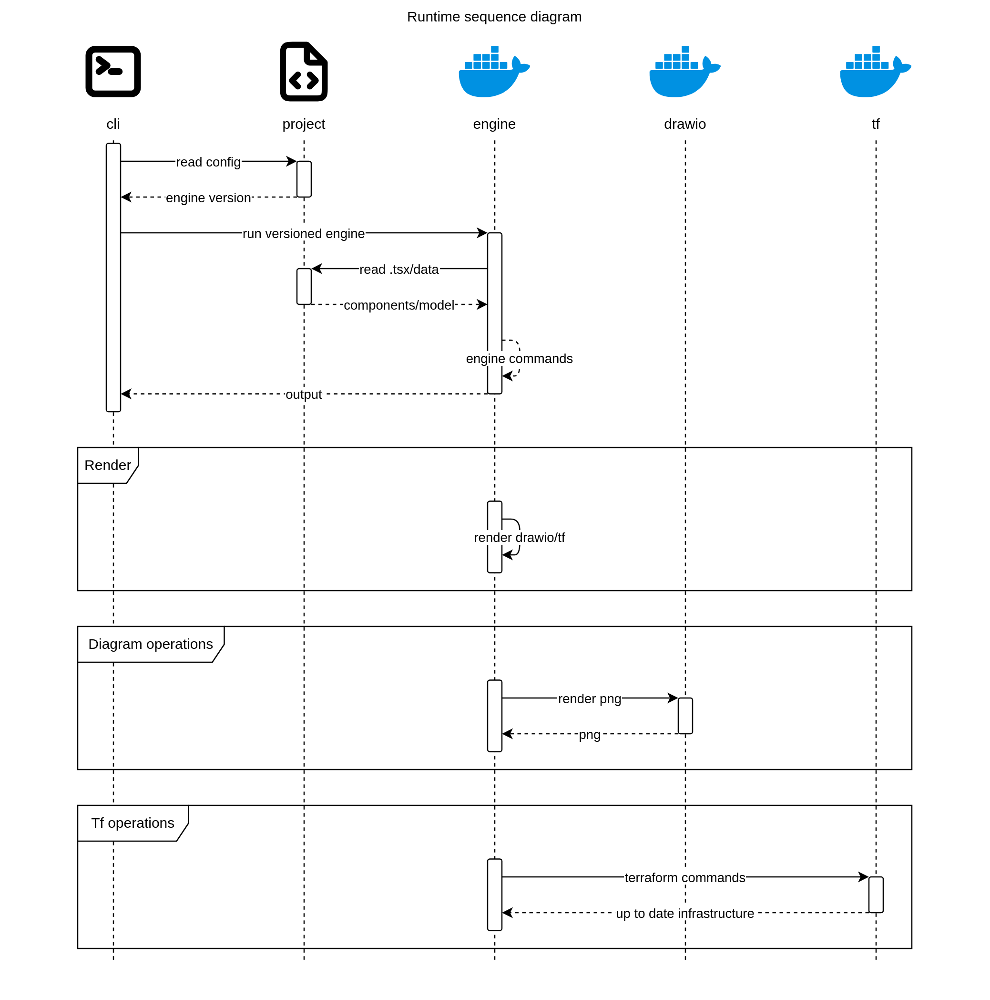

# Sequence diagram
A simple implmentation of standard UML sequence diagram
## Schemas

### ParticipantSchema
A participant in the sequence diagram
<table>
<thead>
<tr>
<th>Name</th>
<th>Type</th>
<th>Description</th>
<th>Required</th>
<th>Default</th>
</tr>
</thead>
<tbody>
<tr>
<td>`title`</td>
<td>
string
</td>
<td style={{"min-width":"200px"}}>
Name of the participant
</td>
<td align="center">❌</td>
<td>

</td>
</tr>
<tr>
<td>`icon`</td>
<td>
Component
</td>
<td style={{"min-width":"200px"}}>
Shape of the participant
</td>
<td align="center">❌</td>
<td>

</td>
</tr>
</tbody>
</table>

### MessageSchema
A message between participants
<table>
<thead>
<tr>
<th>Name</th>
<th>Type</th>
<th>Description</th>
<th>Required</th>
<th>Default</th>
</tr>
</thead>
<tbody>
<tr>
<td>`from`</td>
<td>
string
</td>
<td style={{"min-width":"200px"}}>
Sender participant
</td>
<td align="center">✅</td>
<td>

</td>
</tr>
<tr>
<td>`to`</td>
<td>
string
</td>
<td style={{"min-width":"200px"}}>
Receiver participant
</td>
<td align="center">✅</td>
<td>

</td>
</tr>
<tr>
<td>`message`</td>
<td>
string
</td>
<td style={{"min-width":"200px"}}>
Message content
</td>
<td align="center">❌</td>
<td>

</td>
</tr>
<tr>
<td>`return`</td>
<td>
boolean
</td>
<td style={{"min-width":"200px"}}>
Is this a return message?
</td>
<td align="center">✅</td>
<td>
`false`
</td>
</tr>
<tr>
<td>`dashed`</td>
<td>
boolean
</td>
<td style={{"min-width":"200px"}}>
Is this message dashed?
</td>
<td align="center">✅</td>
<td>
`false`
</td>
</tr>
</tbody>
</table>

### InteractionSchema
<table>
<thead>
<tr>
<th>Name</th>
<th>Type</th>
<th>Description</th>
<th>Required</th>
<th>Default</th>
</tr>
</thead>
<tbody>
<tr>
<td>`title`</td>
<td>
string
</td>
<td style={{"min-width":"200px"}}>
Title of the interaction frame, if not provided, no frame is drawn
</td>
<td align="center">❌</td>
<td>

</td>
</tr>
<tr>
<td>`messages`</td>
<td>
[ [MessageSchema](#messageschema) ]
</td>
<td style={{"min-width":"200px"}}>
Messages in this interaction
</td>
<td align="center">✅</td>
<td>

</td>
</tr>
</tbody>
</table>

### SizeSchema
<table>
<thead>
<tr>
<th>Name</th>
<th>Type</th>
<th>Description</th>
<th>Required</th>
<th>Default</th>
</tr>
</thead>
<tbody>
<tr>
<td>`participant`</td>
<td>
number
</td>
<td style={{"min-width":"200px"}}>
Width of the participant box
</td>
<td align="center">✅</td>
<td>
`60`
</td>
</tr>
<tr>
<td>`timelinePadding`</td>
<td>
number
</td>
<td style={{"min-width":"200px"}}>
Space between each messages
</td>
<td align="center">✅</td>
<td>
`15`
</td>
</tr>
<tr>
<td>`participantsPadding`</td>
<td>
number
</td>
<td style={{"min-width":"200px"}}>
Padding between participant boxes
</td>
<td align="center">✅</td>
<td>
`100`
</td>
</tr>
<tr>
<td>`activationWidth`</td>
<td>
number
</td>
<td style={{"min-width":"200px"}}>
Width of the activation bar
</td>
<td align="center">✅</td>
<td>
`12`
</td>
</tr>
</tbody>
</table>

### SequenceDiagramSchema
<table>
<thead>
<tr>
<th>Name</th>
<th>Type</th>
<th>Description</th>
<th>Required</th>
<th>Default</th>
</tr>
</thead>
<tbody>
<tr>
<td>`participants`</td>
<td>
&lt; string, [ParticipantSchema](#participantschema) &gt;
</td>
<td style={{"min-width":"200px"}}>
Participants in the sequence diagram, if not provided, participants will be inferred from message sources and targets
</td>
<td align="center">✅</td>
<td>
```json
{}
```
</td>
</tr>
<tr>
<td>`messages`</td>
<td>
[ [MessageSchema](#messageschema) ]
</td>
<td style={{"min-width":"200px"}}>
If provided, messages converted as first interaction automatically
</td>
<td align="center">❌</td>
<td>

</td>
</tr>
<tr>
<td>`interactions`</td>
<td>
[ [InteractionSchema](#interactionschema) ]
</td>
<td style={{"min-width":"200px"}}>
Interactions in the sequence diagram
</td>
<td align="center">✅</td>
<td>
```json
[]
```
</td>
</tr>
<tr>
<td>`size`</td>
<td>
[SizeSchema](#sizeschema)
</td>
<td style={{"min-width":"200px"}}>
Size configuration for the diagram
</td>
<td align="center">✅</td>
<td>
```json
{
  "participant": 60,
  "timelinePadding": 15,
  "participantsPadding": 100,
  "activationWidth": 12
}
```
</td>
</tr>
</tbody>
</table>

## Examples

### Dinghy Runtime

A real world example of sequence diagram is the [Dinghy runtime architecture](/get-started/architecture#runtime-sequence-diagram).

import CodeBlock from "@theme/CodeBlock";
import RuntimeTsx from "!!raw-loader!././../../../../get-started/architecture/runtime.tsx";

<CodeBlock language="tsx" title="runtime.tsx">
  {RuntimeTsx}
</CodeBlock>

